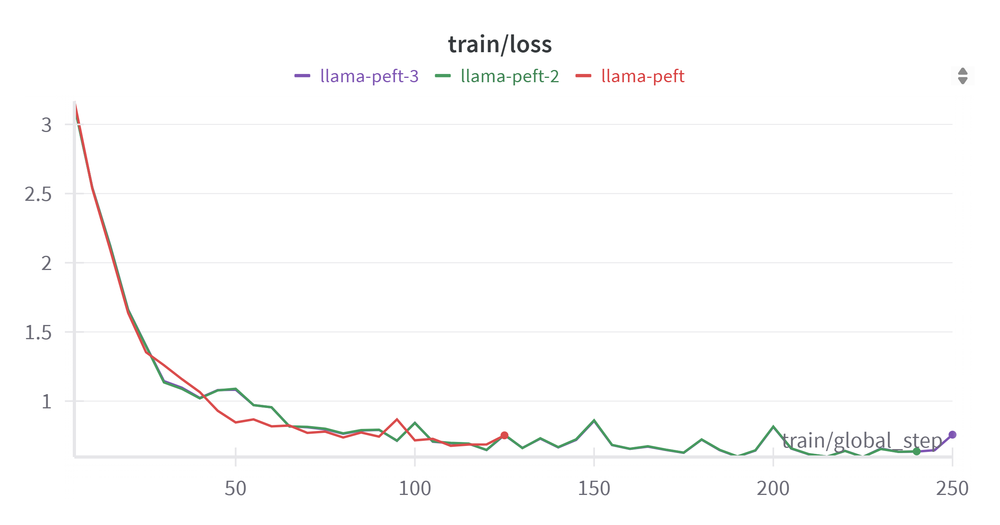
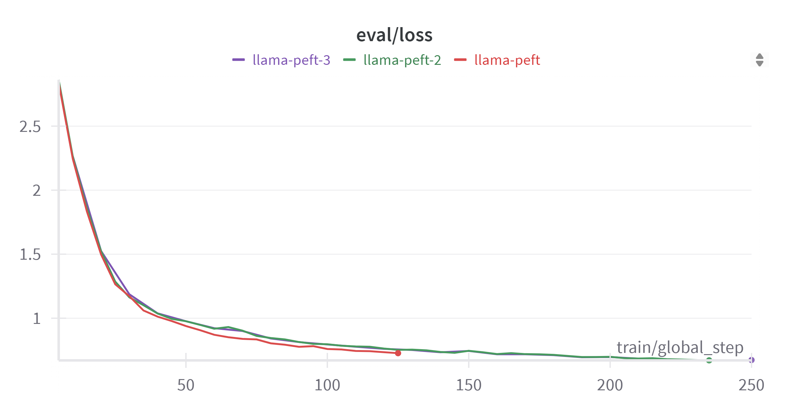

# Fine-tuning Llama 2 for Social Media Ad Generation

This project fine-tunes the Llama 2 7B Chat model to create an AI model specialized in generating social media ad content.

## Overview

The project uses the [meta-llama/Llama-2-7b-chat-hf](https://huggingface.co/meta-llama/Llama-2-7b-chat-hf) model as a base and fine-tunes it on a dataset of social media ad content to create an AI assistant that can generate creative and effective ad copy for various social platforms.

## Dataset

The model was fine-tuned using the [AmmarFahmy/social-ad-generation](https://huggingface.co/AmmarFahmy/social-ad-generation) dataset, which contains examples of high-quality social media ad copy paired with prompts.

## Fine-tuning Process

The fine-tuning was performed using:
- Parameter-Efficient Fine-Tuning (PEFT) with LoRA
- QLoRA 4-bit quantization for memory efficiency
- Training arguments:
  - Learning rate: 2e-4
  - Batch size: 4
  - Gradient accumulation steps: 1
  - Weight decay: 0.001
  - Optimizer: AdamW
  - LoRA parameters: r=64, alpha=16, dropout=0.1

The training was monitored using [Weights & Biases](https://wandb.ai/) where all training logs and metrics are available.

## Results

The fine-tuning process successfully created a model that can generate compelling social media ad content based on input prompts. The training and evaluation loss curves are shown below:




## Usage

The fine-tuned model is available on HuggingFace: [AmmarFahmy/llama-2-7b-social-media-ad-generation](https://huggingface.co/AmmarFahmy/llama-2-7b-social-media-ad-generation)

### To use the model:

```python
from transformers import AutoModelForCausalLM, AutoTokenizer

# Load model and tokenizer
model_name = "AmmarFahmy/llama-2-7b-social-media-ad-generation"
model = AutoModelForCausalLM.from_pretrained(model_name)
tokenizer = AutoTokenizer.from_pretrained(model_name)

# Generate ad content
prompt = "Write a Facebook ad for a new fitness app that helps users track their workouts"
inputs = tokenizer(prompt, return_tensors="pt")
outputs = model.generate(**inputs, max_length=200)
generated_text = tokenizer.decode(outputs[0], skip_special_tokens=True)
print(generated_text)
```

## Acknowledgements

- Base model: [meta-llama/Llama-2-7b-chat-hf](https://huggingface.co/meta-llama/Llama-2-7b-chat-hf)
- Training infrastructure: Google Colab with T4 GPU
- Monitoring: Weights & Biases
